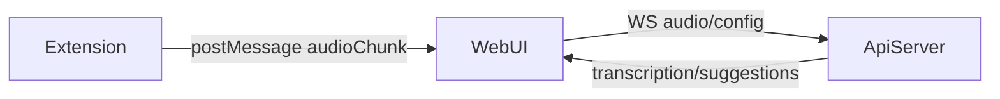

## Web Audio Extension Spec (MVP)

### Goals
- Capture system audio via browser extension.
- Stream audio chunks to the existing API WebSocket.
- Keep UI and backend mostly unchanged.

### High-level flow
1) User opens Web UI.
2) Extension captures audio (tab/system).
3) Extension sends audio chunks to page via `postMessage`.
4) Web UI sends chunks to API WS using existing JSON base64 payload.



### Event channel (Extension <-> Web UI)
Use `window.postMessage` with a fixed `source` field to avoid collisions.

#### From Extension to Web UI
```json
{
  "source": "voicecopilot-extension",
  "type": "ready"
}
```
(Sent once on content script load so the page can detect extension presence.)

```json
{
  "source": "voicecopilot-extension",
  "type": "audioChunk",
  "speaker": "other",
  "sampleRate": 48000,
  "channels": 2,
  "data": "ArrayBuffer"
}
```

```json
{
  "source": "voicecopilot-extension",
  "type": "status",
  "status": "started|stopped|error",
  "message": "optional"
}
```

#### From Web UI to Extension
```json
{
  "source": "voicecopilot-web",
  "type": "startCapture",
  "mode": "tab|system"
}
```

```json
{
  "source": "voicecopilot-web",
  "type": "stopCapture"
}
```

### API WebSocket payload (Web UI -> API)
Use existing JSON base64 format in `apps/web/src/lib/api.ts`.

#### Config
```json
{
  "type": "config",
  "speaker": "user|other",
  "project_id": "project-123",
  "sample_rate": 48000,
  "channels": 2
}
```

#### Audio
```json
{
  "type": "audio",
  "speaker": "user|other",
  "data": "base64_pcm16"
}
```

### Auth (no login)
- Use `X-Project-Token` header on REST requests.
- For WebSocket, include `?token=...` or send an initial JSON auth message.

### Extension detection (fallback)
- Content script sends `{ source: "voicecopilot-extension", type: "ready" }` on load.
- Web UI listens for `ready` and sets `extensionAvailable`. If no `ready` before user starts capture, UI uses getDisplayMedia fallback.

### Fallback without extension (getDisplayMedia)
- If the extension is not installed, Web UI calls `navigator.mediaDevices.getDisplayMedia({ video: true, audio: true })` on "Start stream".
- User picks a screen, window, or browser tab; audio from that source is captured as `speaker: "other"` and sent to the API WebSocket (same payload format).
- Requires the user to choose a source that includes audio (e.g. "Share tab audio" in Chrome). If no audio tracks, UI shows an error.

### Notes
- System audio capture is only possible with browser extension APIs (e.g. tabCapture).
- Microphone capture can stay in Web UI via Web Audio API.
- getDisplayMedia provides tab/window/screen capture with audio without an extension; use it as fallback when the extension is not available.